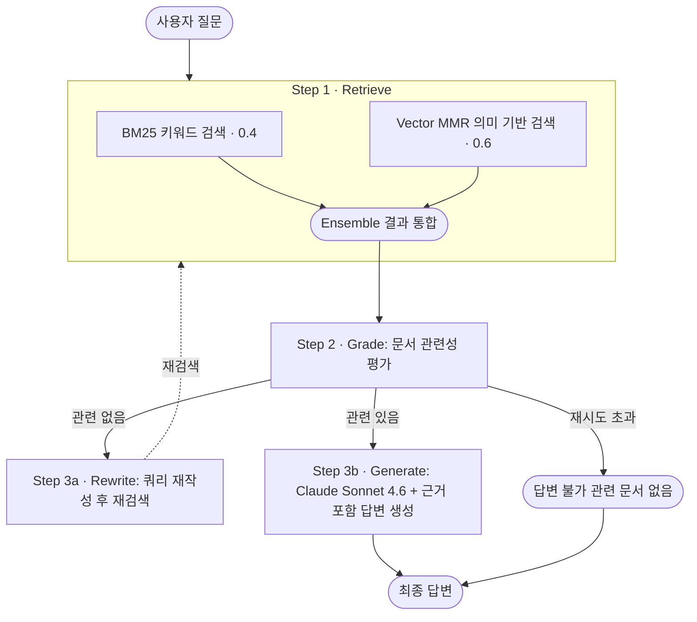
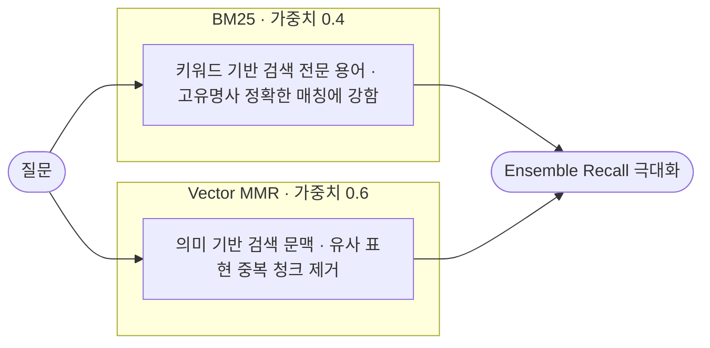

# PDF 문서 참조 AI 에이전트

LangChain + LangGraph를 활용한 Adaptive RAG 기반 PDF 문서 참조 챗봇

---

## 시스템 아키텍처



---

## 기술 선정 이유

### 개발 언어: Python

| 항목 | 내용 |
|------|------|
| **생태계** | LangChain, LangGraph의 공식 지원 언어로 가장 많은 래퍼런스 제공 |
| **AI/ML 표준** | Hugging Face, PyTorch 등 AI 생태계의 사실상 표준 언어 |
| **문서 처리** | docling 등 고급 문서 처리 라이브러리와의 안정성이 높음 |
| **개발 속도** | 빠른 프로토타이핑과 간결한 코드로 RAG 파이프라인 구현에 최적 |

---

### LLM: Claude Sonnet 4.6 (Anthropic)

| 항목 | 내용 |
|------|------|
| **컨텍스트 윈도우** | **200,000 토큰** — 긴 PDF 문서의 전체 내용 처리 가능 |
| **문서 이해력** | 복잡한 PDF 구조와 전문 용어 해석 능력이 타 모델 대비 우수 |
| **Hallucination 억제** | 문서 기반 답변 시 근거 없는 정보 생성 억제 능력이 뛰어남 |
| **한국어 지원** | 한국어 문서 처리 및 답변 생성의 품질이 높음 |

---

### VectorDB: ChromaDB

| 항목 | 내용 |
|------|------|
| **로컬 실행** | 별도 서버, 클라우드 불필요 → 빠른 개발에 적합 |
| **영구 저장** | `persist_directory` 지원 → PDF 재처리 없이 재사용 가능 |
| **LangChain 통합** | LangChain과의 통합이 안정적 |
| **중소규모 최적** | 수백~수천 페이지 규모 문서에 최적화된 성능 |

> Pinecone(클라우드 의존, 비용 발생), FAISS(영구 저장 불편) 대비 개발~운영 균형 최적

---

### 임베딩 모델: BAAI/bge-m3

| 항목 | 내용 |
|------|------|
| **다국어 지원** | 한국어를 포함한 다국어 특화 임베딩 → 한국어 PDF 품질 우수 |
| **무료·로컬** | 로컬 실행으로 API 비용 없음 |
| **벤치마크** | MTEB(Massive Text Embedding Benchmark) 지속적 상위권 |
| **최적화** | `normalize_embeddings=True`로 코사인 유사도 검색 최적화 |

> OpenAI Embedding(유료), ko-sroberta(한국어 단일 언어) 대비 다국어 무료 모델 중 최상위 성능

---

### 문서 파싱: docling

| 항목 | 내용 |
|------|------|
| **구조 인식** | 표·그림·제목·본문 등 문서 구조를 의미 단위로 정확하게 파싱 |
| **Markdown 변환** | 파싱 결과를 Markdown으로 출력 → 청킹 시 문맥 보존에 유리 |
| **복잡한 레이아웃** | 다단 구성, 헤더/푸터, 혼합 레이아웃 처리에 강함 |
| **다양한 포맷** | PDF 외에도 DOCX, PPTX, HTML 등 다양한 문서 포맷 지원 |

> 단순 텍스트 추출에 그치는 PyPDFLoader·PDFPlumberLoader와 달리, 문서의 논리적 구조를 보존하여 RAG 품질 향상

---

### Retriever: Ensemble (BM25 + Vector) + MMR

**왜 단일 검색 방식이 아닌 Ensemble인가?**



| 구성 요소 | 가중치 | 역할 |
|----------|--------|------|
| BM25 | 0.4 | 키워드 정확 매칭 (전문 용어, 고유명사) |
| Vector MMR | 0.6 | 의미 기반 검색 + 중복 청크 제거 |

- 가중치: 관행적인 수치, 직관전 추정(검증하며 튜닝 필요)
- **MMR (Maximal Marginal Relevance)**: 유사한 청크 중복 제거, 다양한 관점의 컨텍스트 확보
- `lambda_mult=0.7`: 관련성(0.7)과 다양성(0.3)의 균형 -> 관련성을 우선 + 최소 다양성 경험적으로 선정 (문서 종류 마다 다르게 설정 필요)
- 순수 벡터 검색 대비 PDF 전문 문서에서 관련 정보 검색률 향상

---

### Prompt Engineering 전략

#### 1. RAG 답변 생성 프롬프트
```
역할 정의     → "제공된 문서만을 기반으로 답변하는 전문가"
환각 방지     → "문서에 없는 내용은 '찾을 수 없습니다' 명시" 규칙 강제
출처 인용     → "문서명, 페이지 번호 반드시 포함" → 신뢰성 확보
답변 형식     → 핵심 먼저, 상세 설명, 출처 순으로 구조화
대화 히스토리 → MessagesPlaceholder로 멀티턴 컨텍스트 유지
```

#### 2. 문서 관련성 평가 프롬프트
```
이진 분류 (yes/no) → 명확한 판단, 파싱 용이
추가 설명 금지     → 일관된 출력 형식 강제
```

#### 3. 쿼리 재작성 프롬프트
```
검색 최적화 목적   → 핵심 키워드 추출, 모호한 표현 구체화
의도 보존 원칙     → 원래 질문의 의미 유지하되 검색에 유리한 형태로 변환
```

---

### LangGraph 패턴: Adaptive RAG

| 항목 | 내용 |
|------|------|
| **조건부 흐름** | 단순 체인 대비 문서 관련성에 따른 분기 처리 가능 |
| **자동 재검색** | 관련 문서 없을 시 쿼리 재작성 → 재검색 자동 수행 |
| **내결함성** | MAX_RETRIES로 무한 루프 방지 |
| **상태 관리** | TypedDict 기반 상태로 대화 컨텍스트 유지 |

---

## 프로젝트 구조

```
├── README.md              # 선정 이유 및 실행 방법
├── Dockerfile
├── docker-compose.yml
├── .dockerignore
├── .env.example           # 환경 변수 템플릿
├── .gitignore
├── requirements.txt       # 의존성 목록
├── main.py                # 진입점 (CLI 챗봇)
├── src/
│   ├── __init__.py
│   ├── config.py          # 설정값 관리
│   ├── document_loader.py # 문서 로드 + 청킹 (docling)
│   ├── vectorstore.py     # ChromaDB 초기화/로드
│   ├── retriever.py       # Ensemble Retriever 생성
│   ├── prompts.py         # 프롬프트 템플릿 정의
│   └── graph.py           # LangGraph 에이전트 구성
└── docs/                  # PDF 파일 보관 폴더
```

---

## 설치 및 실행

### 사전 요구사항

- docker, docker compose 필요

### 1. API 키 설정

```bash
cp .env.example .env
```

`.env` 파일을 열어 Anthropic API 키를 입력합니다:

```
ANTHROPIC_API_KEY=your_anthropic_api_key_here
```

> Anthropic API 키: https://console.anthropic.com

### 2. PDF 문서 준비

```bash
# docs/ 폴더에 참조할 PDF 파일 복사
cp your_document.pdf docs/
```

### 3. 이미지 빌드 및 실행

```bash
docker-compose run --rm rag-agent
```

> 최초 실행 시 이미지 빌드 + BAAI/bge-m3 모델 다운로드(약 1.5GB)로 시간이 걸립니다.
> 이후 실행부터는 캐시를 사용하므로 빠르게 시작됩니다.

### 4. 실행 옵션

| 옵션 | 기본값 | 설명 |
|------|--------|------|
| `--rebuild` | - | 벡터스토어 초기화 (새 PDF 추가 시 사용) |
| `--chunk-size` | `1000` | 청크 크기 (토큰 수) |
| `--chunk-overlap` | `200` | 청크 간 겹치는 토큰 수 |
| `--retriever-k` | `3` | 검색할 문서 청크 수 |
| `--max-retries` | `2` | 쿼리 재작성 최대 횟수 |

```bash
# 새 PDF 추가 후 벡터스토어 재생성
docker-compose run --rm rag-agent python main.py --rebuild

# 옵션 조합 예시
docker-compose run --rm rag-agent python main.py --chunk-size 500 --retriever-k 5
```

---

## 사용 방법

```
========================================================
       PDF 문서 참조 AI 에이전트
       LangChain + LangGraph + Claude Sonnet 4.6
========================================================

[1/3] 문서 로드 중...
[2/3] 벡터스토어 초기화 중...
[3/3] 에이전트 초기화 중...

준비 완료! 질문을 입력하세요.
명령어: 'quit'/'exit' 종료 | 'clear' 대화 초기화 | 'history' 대화 내역
------------------------------------------------------------

질문: 문서에서 설명하는 주요 개념은 무엇인가요?

  [검색] 관련 문서 검색 중...
  [평가] 문서 관련성 평가 중...
  [생성] 답변 생성 중...

답변:
(문서 기반 답변 + 출처 표시)
------------------------------------------------------------
```

### 명령어

| 명령어 | 동작 |
|--------|------|
| `quit` / `exit` | 프로그램 종료 |
| `clear` / `초기화` | 대화 내역 초기화 |
| `history` / `내역` | 대화 내역 확인 |

---

## 기술 스택 요약

| 구분 | 선택 | 이유 요약 |
|------|------|-----------|
| 언어 | Python 3.11 | LangChain/LangGraph 공식 지원, AI 생태계 표준 |
| LLM | Claude Sonnet 4.6 | 문서 이해력·한국어 품질·200K 컨텍스트 |
| VectorDB | ChromaDB | 로컬, 영구 저장, LangChain 통합 안정적 |
| 임베딩 | BAAI/bge-m3 | 다국어(한국어) 특화, 무료, 고성능 |
| 문서 파싱 | docling | 구조 인식·Markdown 변환으로 RAG 품질 향상 |
| Retriever | Ensemble (BM25+Vector) + MMR | 키워드+의미 결합으로 Recall 극대화 |
| 프레임워크 | LangChain + LangGraph | RAG 파이프라인 + 조건부 에이전트 흐름 |
